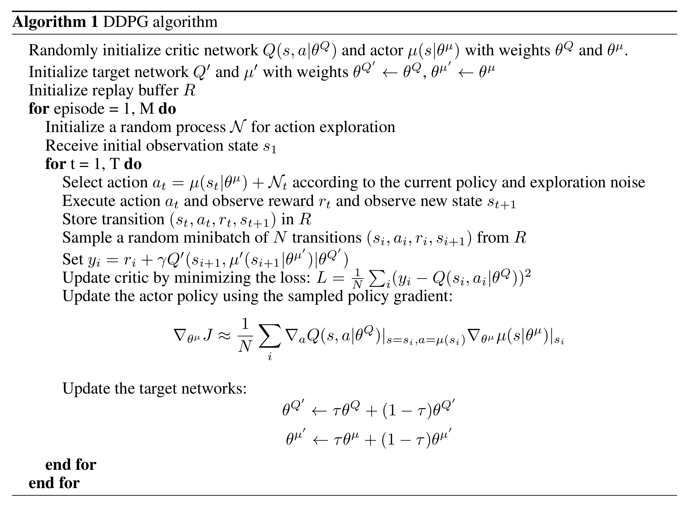
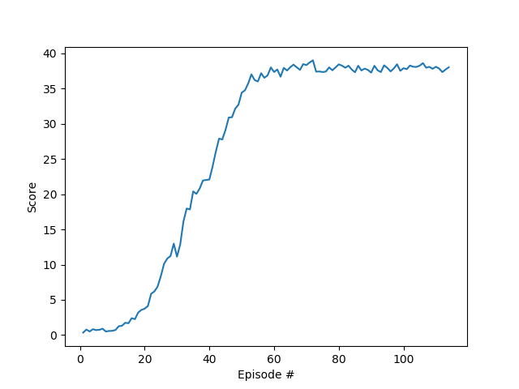

# Report

## Solution

#### Method 

The agent will be trained using a Deep Deterministic Policy Gradients (DDPQ) algorithm based on this [paper](hhttps://arxiv.org/pdf/1509.02971.pdf) .

The solution is deploying the Deep Deterministic Policy Gradient (DDPG) based on the [DDPG-Bipedal](https://github.com/udacity/deep-reinforcement-learning/tree/master/ddpg-bipedal) and [DDPG-Pendulum](https://github.com/udacity/deep-reinforcement-learning/tree/master/ddpg-pendulum) Udacity projects.

*DDPG Algorithm pseudocode*

#### Hyperparameters

Values for the hyperparameters were obtained from the original paper and reference implementations 
and then tweaked based on the results of multiple runs.

| Hyperparameter | Value | Description |
|---|---:|---|
| BUFFER_SIZE | 1e6 | Maximum size of experience replay buffer |
| BATCH_SIZE | 128 | Number of experiences sampled in one batch |
| fc1_units, fc2_units | 400, 300 | Number of units in hidden layers of the actor model |
| fcs1_units, fcs2_units | 400, 300 | Number of units in hidden layers of the critic model |
| LR_ACTOR | 3e-4 | Controls parameters update of the online actor model |
| LR_CRITIC | 3e-4 | Controls parameters update of the online critic model |
| TAU | 1e-3 | Controls soft update of target parameters |
| GAMMA | 0.99 | Discount rate for future rewards |
|  mu | 0 | Ornstein-Uhlenbeck, mean of the stochastic  process|
| theta | 0.15 | Ornstein-Uhlenbeck, parameter of the stochastic process |
| sigma | 0.2 | Ornstein-Uhlenbeck, standard deviation of the stochastic process |
| n_episodes | 2000 | Maximum number of episodes to train |
| max_t=1000 | 1000 | Maximum number of timesteps per episode |

#### Results

    Episode 100 (31 sec)  -- 	Min: 33.8	Max: 39.6	Mean: 37.9
    Episode 101	Total Average Score: 25.21	Mean: 37.73	Min: 33.94	Max: 38.94	Duration: 30.65
    Episode 102	Total Average Score: 25.58	Mean: 38.25	Min: 36.79	Max: 39.47	Duration: 30.36
    Episode 103	Total Average Score: 25.96	Mean: 38.07	Min: 34.38	Max: 39.17	Duration: 31.82
    Episode 104	Total Average Score: 26.33	Mean: 38.05	Min: 35.41	Max: 39.32	Duration: 32.52
    Episode 105	Total Average Score: 26.70	Mean: 38.23	Min: 36.57	Max: 39.59	Duration: 31.47
    Episode 106	Total Average Score: 27.08	Mean: 38.59	Min: 37.03	Max: 39.56	Duration: 30.17
    Episode 107	Total Average Score: 27.45	Mean: 37.94	Min: 35.30	Max: 39.30	Duration: 29.90
    Episode 108	Total Average Score: 27.83	Mean: 38.06	Min: 35.69	Max: 39.28	Duration: 30.45
    Episode 109	Total Average Score: 28.20	Mean: 37.78	Min: 34.91	Max: 39.48	Duration: 31.65
    Episode 110	Total Average Score: 28.58	Mean: 38.07	Min: 35.72	Max: 39.18	Duration: 31.70
    Episode 110 (32 sec)  -- 	Min: 35.7	Max: 39.2	Mean: 38.1
    Episode 111	Total Average Score: 28.95	Mean: 37.83	Min: 35.27	Max: 39.45	Duration: 30.31
    Episode 112	Total Average Score: 29.31	Mean: 37.31	Min: 35.62	Max: 39.06	Duration: 30.79
    Episode 113	Total Average Score: 29.67	Mean: 37.68	Min: 35.33	Max: 39.16	Duration: 30.47
    Episode 114	Total Average Score: 30.03	Mean: 38.01	Min: 36.15	Max: 39.52	Duration: 32.95
    Problem Solved after 114 epsisodes Total Average score: 30.03

	
*Results Graph*

## Future Work

##### More systematic way of searching of optimal values for hyperparameters:
 
 - Grid Search
 - Random Search
 - Bayesian Optimization
 - Genetic Algorithm

##### Experiment with other algorithms: 
 - [Trust Region Policy Optimization (TRPO)](https://arxiv.org/abs/1502.05477)
 - [Proximal Policy Optimization (PPO)](Proximal Policy Optimization Algorithms)
 - [Distributed Distributional Deterministic Policy Gradients (D4PG)](https://arxiv.org/abs/1804.08617)

